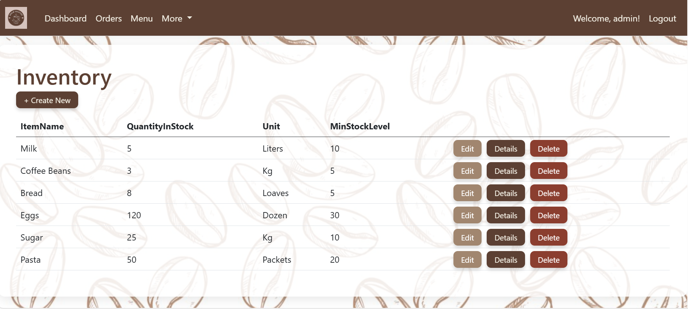
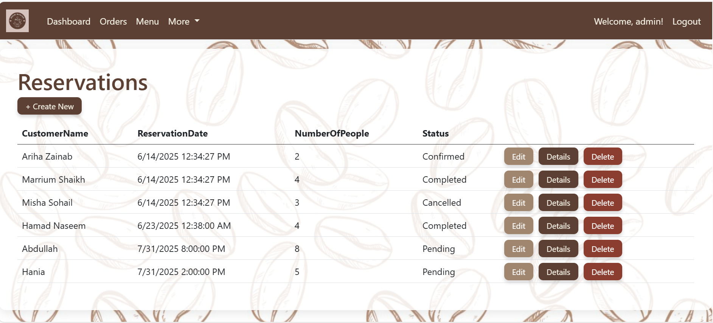

# Cafe Management System

A full-featured web-based Cafe Management System built using **ASP.NET Core MVC** and **SQL Server**, with a Bootstrap-themed UI. The system manages orders, reservations, menu items, billing, inventory, and more.

## Features
-  User Login & Role-based Access (Admin, Waiter)
-  Menu Item Management (Add, Edit, Delete)
-  Order Creation & Billing
-  Inventory Tracking
-  Table Reservation
-  Dashboard & Reports

---

## Screenshots

### Home Screen


### Login Page


### Admin Dashboard


### Orders Management


### Menu Management


### Inventory Management


### Table Reservations


### Billing Page


---

## Tech Stack
- ASP.NET Core MVC
- SQL Server
- Entity Framework
- Bootstrap (Custom theme)
- Visual Studio 2022

---

## Created By
- Ariha Zainab  

---

## Project Setup
1. Clone the repository:
   ```bash
   git clone https://github.com/2280138/CafeManagementSystem.git

2. Open the solution file in Visual Studio.

3. Restore NuGet packages and build the solution.

4. Configure your database connection in appsettings.json.

5. Run the application.

---

## License
This project is for academic purposes only.

